# Final Report: eShopOnWeb — End-to-End Deployment

## 1. Goal

The final goal of the course was to integrate all previously developed components of **eShopOnWeb** into a complete cloud-native solution, following the architecture diagram below.

---

## 2. Architecture Diagram

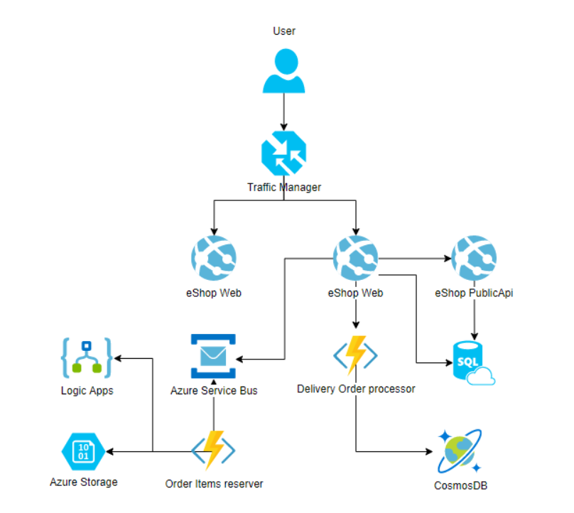

---

## 3. Implemented Components

1. **Traffic Manager**
   - Configured to load balance web applications across regions.

2. **Web Application (eShopOnWeb)**
   - Deployed to Azure App Service.
   - Supports **auto-scaling**.
   - Supports **deployment slots** (staging/production).

3. **Public API**
   - Packaged as a **container** and deployed to Azure App Service from **Azure Container Registry (ACR)**.
   - Connected to **Azure SQL** for persistent storage.

4. **Azure SQL Database**
   - Two logical databases created:
     - `CatalogDB` (Product catalog)
     - `IdentityDB` (Authentication/authorization).

5. **Order Items Reserver Function**
   - Implemented as an **Azure Function** (ServiceBusTrigger).
   - Receives order details from Service Bus, generates **Reservation JSON**, and uploads it to **Azure Blob Storage**.
   - Retry policy (up to 3 attempts).
   - **Fallback**: if blob upload fails, the message goes to **DLQ**, and a **Logic App** sends an email notification.

6. **Delivery Order Processor Function**
   - Another **Azure Function** subscribed to Service Bus messages.
   - After order creation, enriches details and saves them into **CosmosDB**.

7. **CosmosDB**
   - Database: `Delivery`
   - Container: `Orders`
   - Partition Key: `/orderId`
   - Stores structured order documents for future processing/analytics.

8. **Logic App**
   - Subscribed to Service Bus **DLQ**.
   - On error, sends **email notifications** with full order JSON details.

---

## 4. Deployment Summary

- **Resource Group:** `rg-eshop-final`/`rg-eshop-dev`
- **Region:** Central US / West Europe
- **App Service Plan:** `plan-eshop-final`
- **Web App:** `app-eshop-web`/`eshop-web-dev`
- **Public API App:** `app-eshop-api`
- **Azure Container Registry:** `acreshopfinal`
- **Azure SQL Databases:** `CatalogDB`, `IdentityDB`
- **Cosmos DB:** `cosmos-eshop-final`
- **Service Bus:** `sb-eshop-final` with Queue `orderreserve`
- **Functions:** 
  - `func-orderitems-reserver`
  - `func-delivery-processor`
- **Logic App:** `logic-app-eshop`
- **Storage Account:** `steshopfinal` (Blob container `orders`)

---

## 5. Testing

✅ **Positive test**:  
- Create order in eShopOnWeb → JSON generated in **Blob Storage**.  
- Delivery Processor stored enriched document in **CosmosDB**.

✅ **Negative test (Blob failure)**:  
- Modified invalid connection string for Blob.  
- Order message redirected to **DLQ**.  
- Logic App successfully sent email with order details.  

---

## 6. Definition of Done ✅

- [x] Web apps balanced with **Traffic Manager**  
- [x] Web apps support **auto-scaling**  
- [x] Deployment slots enabled  
- [x] Web & Public API use **Azure SQL**  
- [x] Public API deployed as **Container**  
- [x] Order Items Reserver function → Blob Storage (with retry & fallback via Logic App)  
- [x] Delivery Order Processor → saves details into **CosmosDB**  
- [x] Screenshots provided (resources, blob, cosmos, logic app)  

---

## 7. Screenshots

1. **Azure Resources Overview**  
   Resource group with all deployed components
   - rg-eshop-final
   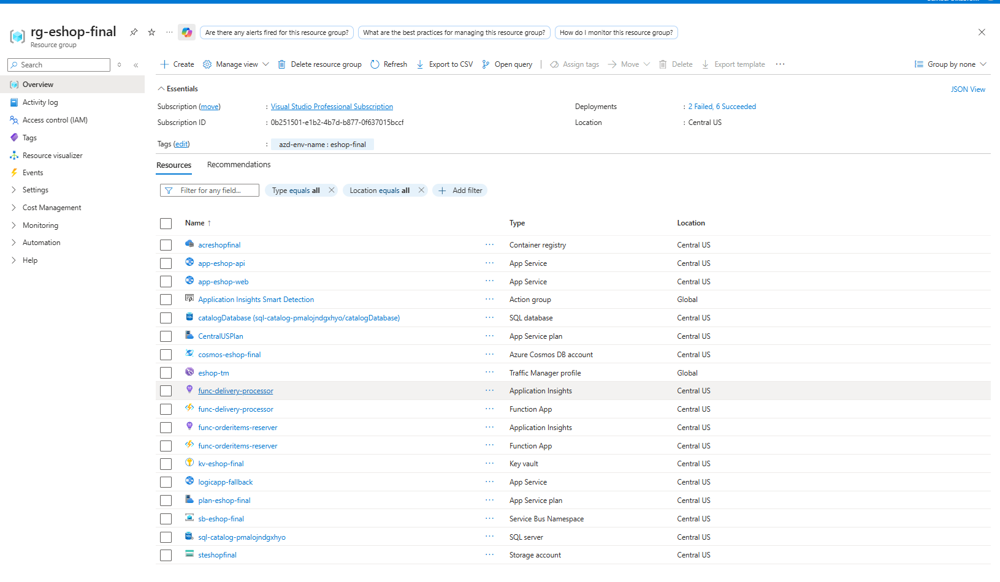
   - rg-eshop-dev
   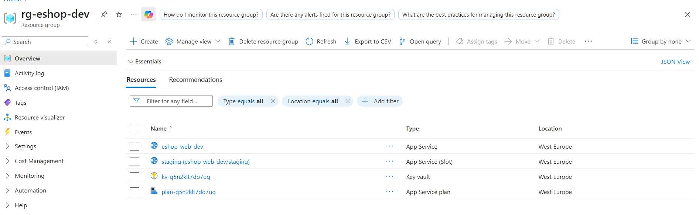

2. **Blob Storage — Order JSON**  
   - Uploaded order JSON in Blob Storage
   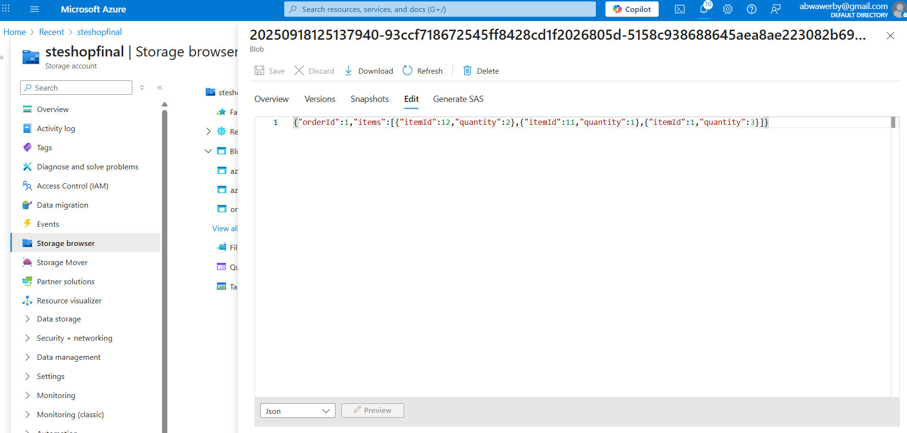
   - OrderItemsReserver Function
   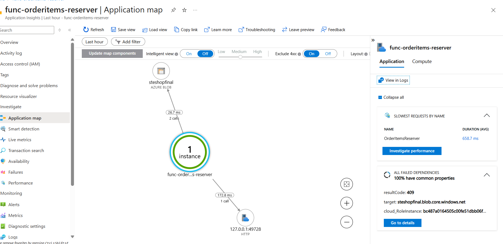
  
3. **CosmosDB — Order Document**  
   - Uploaded order JSON in CosmosDB — Order
   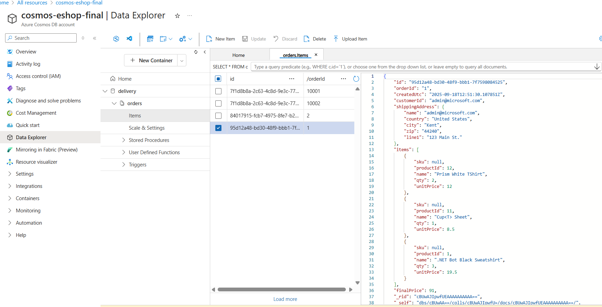
   - Delivery Processor Function logs.
   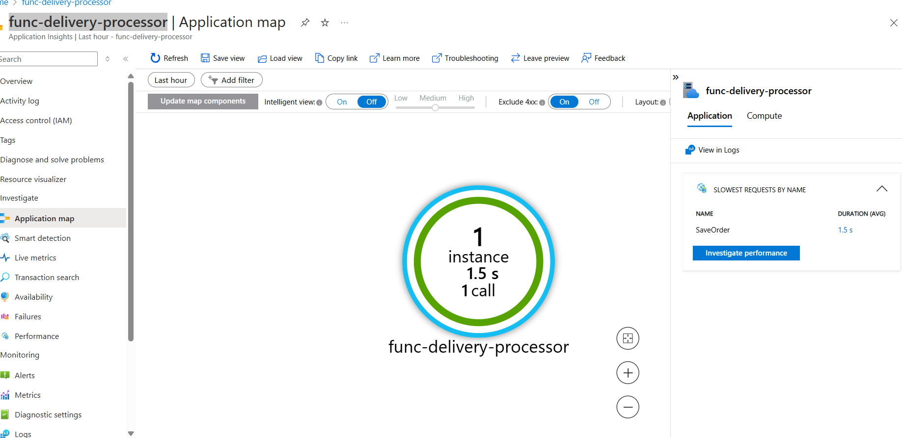

4. **Logic App — Email Fallback**  
   Logic App fallback flow.
   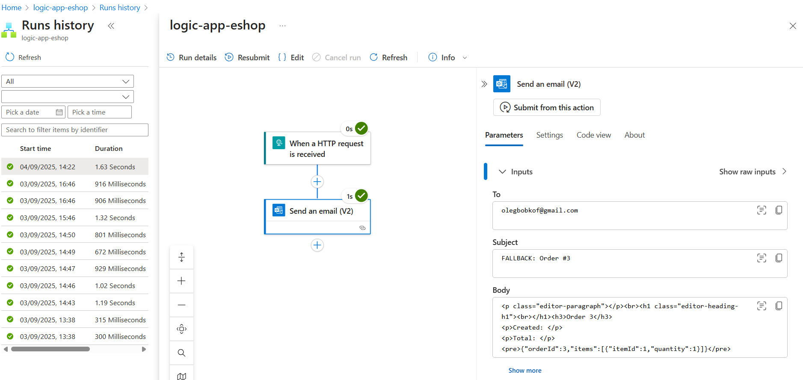

5. **Traffic Manager**  
   Traffic Manager configuration.
   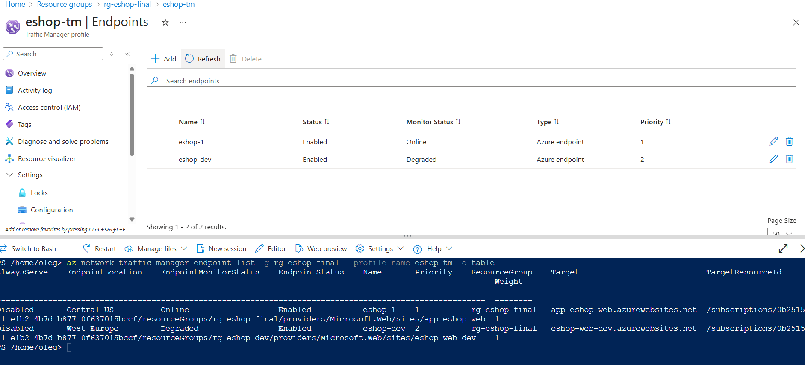

6. **Web App** 
   - Web App UI - Admin
   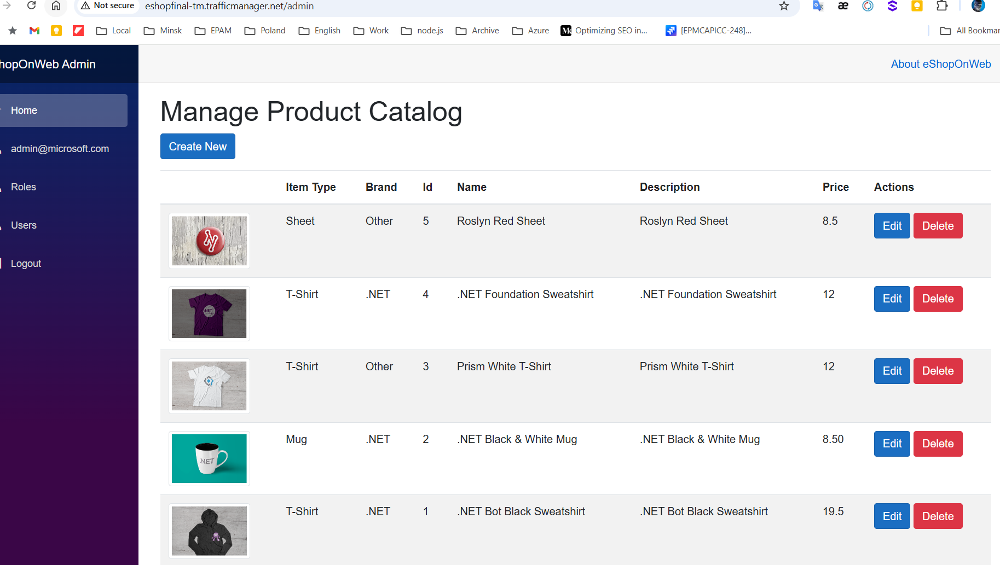
   - Web App UI - Orders
   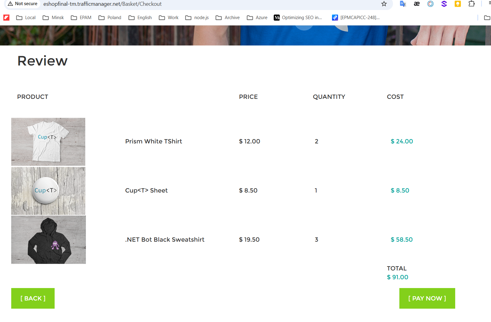
   - Web App UI - Orders
   

7. **API App**
   - Public API container deployed from ACR.
   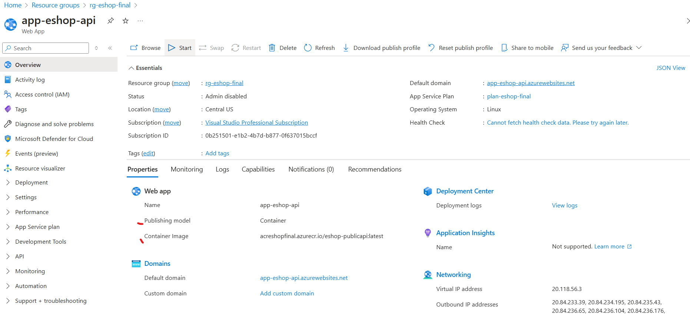
